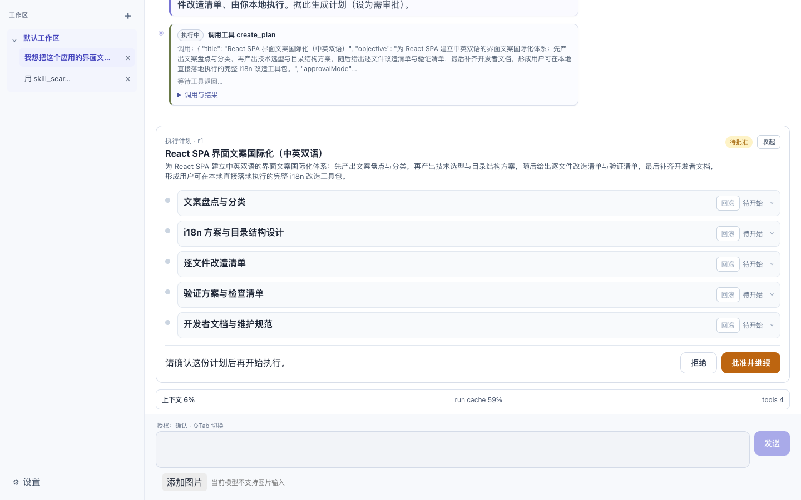

# Einfach Agent

[English](README.md) | 中文

**装配式 Agent Runtime 开发者框架。** 一个可插拔内核——工具契约、插件、观测、持久化、
子 Agent 委派全部按槽位注入——驱动三种形态：浏览器 + 本机 Node 后端的自托管应用、
没有本机能力的纯静态产物、以及 headless CLI；DeepSeek / GLM 等模型是一等公民，而不是事后适配。

> einfach 是德语的"简单"：内核只管该管的，其余全部换得掉。


## Quickstart

前置条件：Node.js **≥ 22.13**；包管理器固定用 **pnpm**（仓库靠 `workspace:*` 互链，
`npm install` 会装出错误的依赖树）。见[环境要求](#环境要求)。

```bash
# 1. 拉取仓库
git clone https://github.com/allroad88888888/einfach-agent.git && cd einfach-agent

# 2. 安装并链接全部 workspace 包
pnpm install

# 3. 完整形态：先构建一次前端，再起本机服务。
#    它会打印一条带一次性 token 的 URL，并自动打开浏览器。
pnpm build
pnpm serve

# 4. 首次打开后在设置页填模型 Key：本机 Node 后端把它写进 ~/.webAgent/config.json，
#    浏览器侧从头到尾拿不到真实 Key（见「配置模型」）。

# 5. 或者一条命令跑一次真实 run（headless；CLI 宿主同样有本机文件 / shell / Git 工具，
#    作用范围由 --workspace 决定，默认当前目录）
pnpm cli -p "搜索并读取 planning skill，用三句话总结这个项目的计划机制"
```

脚本名是 `pnpm serve` 而不是 `pnpm server`——`server` 是 **pnpm 的保留子命令**。它默认绑
`127.0.0.1:4765`（端口被占用时自动往后试），`--no-open` 可以不自动开浏览器。它托管的前端就是
`pnpm build` 的产物；没构建过时每个页面都回一个 503，页面上写着该去跑哪条命令。

`pnpm dev` 起的是 Vite 预览：同一套界面，没有后端，也就没有任何本机能力。

## 能力边界

- **浏览器 + 本机 Node 服务**（`pnpm serve`）：完整产品形态，可使用 shell、workspace 文件、
  ripgrep、任务执行、补丁、Git diff、MCP stdio 服务以及 SQLite 会话/trace。前端启动时探测
  `GET /api/health`，答得上就落到 `server` 宿主态，此后每一次本机能力调用都经
  `POST /api/invoke/:command` 打到 `packages/host-node`。
- **纯静态产物**（`pnpm dev`，或任何没有后端的部署）：同一套 React UI 和 Agent Runtime，但探测
  失败、不登记命令桥，于是所有需要本机的工具（文件、shell、Git、ripgrep）**从模型可见清单里
  整类消失**，而不是等调用时才失败。`pnpm dev` 另外还能经 Vite 开发中继发模型请求；构建后的静态
  部署使用明确的浏览器 BYOK：Key 保存在该浏览器 localStorage，直接请求 provider，provider 必须为
  部署域名放行 CORS。
- **headless CLI**：无 UI 驱动真实 run，用于 dogfood、自动化和编码 Agent 自测。它在进程内加载
  同一份 `packages/host-node` 能力实现，所以工具面对的就是本机；它不配置持久化，会话只活到进程
  退出为止。`-v` 把 trace 与性能诊断打到 stderr。
- **模型接入**：当前支持 DeepSeek 与 GLM；Kimi `kimi-k2.6` 与图片输入已实现，但真实 Key 验收前
  保持开放门禁关闭。
- **运行时能力**：多会话、checkpoint/revert、lazy tool schema、危险工具确认、结构化计划与评估、
  树形子 Agent、后台执行图、上下文压缩与 provider context cache 统计、持久化和 trace viewer。

## 装配式内核

`packages/agent-core` 只提供机制，不提供实现。`createCore()` 造出的每个实例私有持有
store、工具 registry、abort registry、插件宿主和观测出口，能在同一进程里跑两份互不干扰：

| 槽位 | 注入什么 |
| --- | --- |
| `registerTools` | 工具集。不传则该实例**没有任何工具**；应用侧调 `registerStandardTools` 装齐六域 |
| `plugins` | 循环插件。压缩、finish reason、loop guard、迁移都是插件，不是主循环里的 if |
| `observability` | trace 出口（IndexedDB / SQLite / stderr / 静默） |
| `projectSkillsProvider`、`skillRegistry` | 项目 Skills 扫描与内置 skill 清单 |
| `planRuntime` | 结构化计划运行时 |
| `delegation` | 子 Agent 委派运行时；不注入就没有子 Agent |
| `config` | apiKey、vendor 等运行时配置 |

会话/历史持久化不走构造参数，由宿主通过 persistence bridge 配置 driver。

依赖方向单向，且**不靠自觉**：

```text
packages/agent-ai ← packages/agent-core ← {tools-*、能力包} ← app
```

`node scripts/check-boundaries.js` 在 CI 里排在测试之前，静态扫描 import 语句，一旦 core 引入
React、任何 `@einfach-agent/tools-*` 或持久化/观测/子 Agent 能力包就直接失败。

## 一个内核，一份本机能力实现

本机能力只实现**一份**（TypeScript），两条传输到达它：

```text
              ┌─ 浏览器 ───── HTTP ─────┐
agent-core ──▶│                        ├──▶ packages/host-node ──▶ 系统调用
              └─ CLI ────── 进程内 ─────┘
```

各装配入口各自选实现：

- **Web 装配** —— `apps/web/src/main.tsx`：标准工具 + React UI + MCP 应用层。它在启动时解析一次
  宿主态，并据此选出命令桥、模型传输、凭据宿主、持久化与 trace driver——`server` 态用打到后端的
  SQLite，`static` 态只剩 IndexedDB。
- **本机服务** —— `apps/server`：一个 Node HTTP 进程，托管构建好的前端，并把
  `/api/invoke/:command` 路由进 host-node 的命令表。它只绑回环地址，每一条 `/api/*` 都要过
  对端地址、`Host`/`Origin` 与启动时打印的那枚 token 四道判定——只有健康探测豁免 token，
  好让「没带 token 打开的页面」响亮地降级而不是静默失能。
- **headless CLI** —— `apps/cli/src/runtime.ts`：同一套标准工具，进程内挂同一个 host-node 桥，
  stderr trace，无 React。
- **能力实现** —— `packages/host-node`：全部 30 条宿主命令（workspace 读/写/补丁、shell、Git、
  ripgrep、MCP stdio、SQLite、模型代理与凭据存储），上面两个宿主共用这一份。



## 环境要求

- Node.js ≥ 22.13——持久化用的是内置 `node:sqlite`，22.13 起才不需要 `--experimental-sqlite`
  旗标。这条下限写在 `@einfach-agent/server` 与 `@einfach-agent/host-node` 的 `engines` 里。
- pnpm（仓库使用 `workspace:*`，不要使用 npm 安装依赖）

构建产物：前端落在 `apps/web/dist/`；`apps/server` 打包成 `apps/server/dist/main.js`，并把那份
前端产物复制进 `apps/server/dist/public/`，因此 server 包脱离仓库工作树也能跑。

## 配置模型

`.env.example` 中的密钥变量仅供 `pnpm dev` 的本机 Web 开发中继使用。`pnpm serve` 的应用会把设置页
填写的模型 Key 交给本机 Node 后端，写入 `~/.webAgent/config.json`；构建后的静态部署则使用设置页明确
填写的浏览器 BYOK。新默认文件不存在时，后端才会安全复制旧 `~/.web-agent/config.json`；新文件优先，
旧文件会保留。

CLI 宿主读同一份 `~/.webAgent/config.json`，也可用 `--config <文件>` 指定其他路径。

`WEB_AGENT_CONFIG_DIR` 只选择配置目录，例如 `$HOME/.webAgent`，不是模型 Key 来源；设置覆盖目录
时不会迁移旧配置。多实例、目录要求与迁移细节见[配置目录说明](docs/config-directory-override.md)。

新会话默认使用 DeepSeek；会话设置中的 `vendor` 决定实际调用的 provider。Kimi 入口还受公开构建
变量 `VITE_KIMI_IMAGE_INPUT_ENABLED` 控制，真实中国区 Key 端到端验收前必须保持 `false`。

`deepseek-v4-flash-vision-exp` 支持图片输入。Composer 中的 JPEG、PNG、WebP 附件保留原始字节，经
DeepSeek [Files API](https://api-docs.deepseek.com/zh-cn/guides/files_api) 临时上传。模型可调用的 `view_image`
工具默认 `detail: 'low'`：上传前将静态图缩进 512×512 包围盒；OCR、截图小字、密集图表或精细视觉比较应
使用 `detail: 'high'`，它保留原始像素。用于图片观察的文件会在完成或失败后尽力删除。上游图片接口见
DeepSeek [Vision 指南](https://api-docs.deepseek.com/zh-cn/guides/vision)。

server 宿主的密钥只由本机 Node 后端读取并注入受限 provider 传输，响应不会把它回传给浏览器。静态
BYOK 刻意不同：Key 以明文留在浏览器 localStorage，浏览器直接把它发给所选官方 provider。同源 XSS
或受信任的浏览器扩展都可能读取它，因此只在可信部署使用；清除网站数据即可删除。Key 绝不会编译进
前端包。Unix 平台的新建配置目录为 `0700`、配置文件为 `0600`；既有覆盖目录必须通过私有权限检查。
Kimi 图片上传、`ms://` 引用与清理语义属于 Kimi adapter；后端只提供端点白名单内的通用 JSON/multipart
传输。

## 开发命令

```bash
pnpm install

# Web 开发预览（无后端，也就没有本机能力）
pnpm dev

# 类型检查 + 生产构建（先前端，再 server 包）
pnpm build

# 自托管本机服务；需要先跑过一次 pnpm build
pnpm serve

# headless CLI 宿主：-p 跑一轮后退出，无 -p 进入 REPL；-h 看全部选项
pnpm cli -p "<prompt>"
pnpm cli -h

# 前端测试
pnpm test

# 三条门禁，顺序与 CI 一致，都排在 pnpm test / pnpm build 之前
node scripts/check-docs.js               # 文档相对链接
node scripts/check-boundaries.js         # 装配边界
node scripts/check-state-invariants.js   # 状态机制不变量

# CI 随后重建全部可分发包的 dist 并校验。顺序不能倒：server 包要嵌入 pnpm build 产出的那份前端
pnpm -r build && node scripts/check-dist.js
```

`pnpm build` 过程中打印的 chunk 体积、chunk 拆分和动态导入相关警告是预期噪音，
不代表构建失败——以命令退出码为准。

运行单个测试：

```bash
pnpm exec vitest run packages/agent-core/src/runtime/modelRun.singleTurn.test.ts
pnpm exec vitest run -t "ask_user"
```

测试文件并行运行，靠 `vite.config.ts` 的 `isolate: true` 隔离：每个文件有独立 worker，
`defaultCore` / `toolRegistry` 这类模块级单例在每个 worker 里各有一份，
`apps/web/src/test/setup.ts` 在 worker 内注册标准工具，并只在用例之间重置 `defaultCore` 的
root/session store。跨文件不会互相污染，因此不需要串行。需要更强隔离的测试应显式调用
`createCore()` 或 `createCoreInstance()` 建独立实例，而不是退回文件串行。

## 在仓库外运行

这些包**不发布到任何 registry**——下面四个包的 `private: true` 是有意为之的护栏，不是遗漏。
想在工作树之外跑，就自己打包再装：

```bash
pnpm build && pnpm -r build
pnpm pack --pack-destination /tmp/einfach-agent \
  --filter @einfach-agent/server --filter @einfach-agent/core \
  --filter @einfach-agent/ai --filter @einfach-agent/host-node

cd /tmp/einfach-agent && npm install *.tgz
./node_modules/.bin/einfach-agent --no-open
```

必须用 `pnpm pack` 而不是 `npm pack`：只有 pnpm 会把 `workspace:*` 改写成真实版本号。
bin 名是 `einfach-agent`、包名是 `@einfach-agent/server`，**两者不是一回事**——
`npx einfach-agent` 解析的是另一个不存在的非 scoped 包，请按上面的方式装 tarball。

## 仓库结构

```text
.
├── apps/
│   ├── web/
│   │   ├── index.html           # Vite HTML 入口
│   │   └── src/                 # React 装配、UI、样式与组件测试
│   ├── server/                  # 本机 HTTP 宿主：托管前端 + /api/invoke + 模型代理
│   └── cli/                     # headless CLI 宿主（dogfood 与自动化驱动真实 run）
├── packages/
│   ├── agent-ai/                # DeepSeek / GLM / Kimi API 适配
│   ├── agent-core/              # 装配式内核：状态、运行时、工具契约、plugin/观测/持久化 contract
│   ├── agent-react/             # React 插件安装面与 timeline renderer registry
│   ├── agent-plugin-example/    # 插件契约的可运行样例
│   ├── host-node/               # 本机能力实现：所有宿主命令背后的那一份 Node 代码
│   ├── subagents/               # 委派调度、批次、归档治理与视图 state
│   ├── persistence-idb/         # IndexedDB 会话/历史持久化 driver
│   ├── persistence-sqlite/      # SQLite 会话/历史持久化 driver
│   ├── observability-idb/       # IndexedDB trace driver 与 reader
│   └── observability-sqlite/    # SQLite trace driver 与 reader
├── tools/
│   ├── standard/                # 六个工具域的 meta 聚合包
│   ├── shell/                   # shell / task / Git
│   ├── fs/                      # workspace 文件、搜索和补丁
│   ├── interaction/             # ask_user / browser card / artifact
│   ├── planning/                # 结构化计划工具
│   ├── skills/                  # skill 搜索与读取
│   ├── agents/                  # delegate / observe / join Agent
│   └── mcp/                     # 第七域，不在标准包里，由应用层按需装配
├── docs/                        # 当前实现说明与仍在推进的演进蓝图
└── scripts/                     # 门禁脚本与子 Agent archive/skill 治理
```

Core 不自动安装具体工具或能力实现。应用入口安装标准工具集，并向 `createCore`/默认实例装配
project skills、plan、delegation、持久化与观测所需的能力；其他消费方也可以只注册需要的工具域。

## 深入设计

想知道内核为什么长这样，以及踩过哪些坑。其中较早的几篇仍在描述已经删除的 Tauri 桌面宿主：

- [一个内核，三个宿主：装配式 Agent Runtime 设计](docs/launch/articles/assembly-kernel.md)
- [给工具加生命周期：CallTiming 机制](docs/launch/articles/call-timing.md)
- [子 Agent 治理：replay、容量与归档](docs/launch/articles/subagent-governance.md)
- [用 CLI 宿主 dogfood，十分钟抓出一个线上 400](docs/launch/articles/dogfood-400.md)
- [DeepSeek V4 thinking 协议踩坑实录](docs/launch/articles/deepseek-v4-pitfalls.md)

## 文档与参与

- 完整文档导航见 [docs/README.md](docs/README.md)：区分当前有效说明与仍在推进的演进蓝图；
  已完成的阶段性 PLAN 只保留在 Git 历史中。
- 提 PR 前先读 [CONTRIBUTING.md](CONTRIBUTING.md)：环境准备、提交前门禁、commit 约定和代码红线。
- 仓库内编码 Agent 的工作约定见 [CLAUDE.md](CLAUDE.md)。

## License

[MIT](LICENSE)
