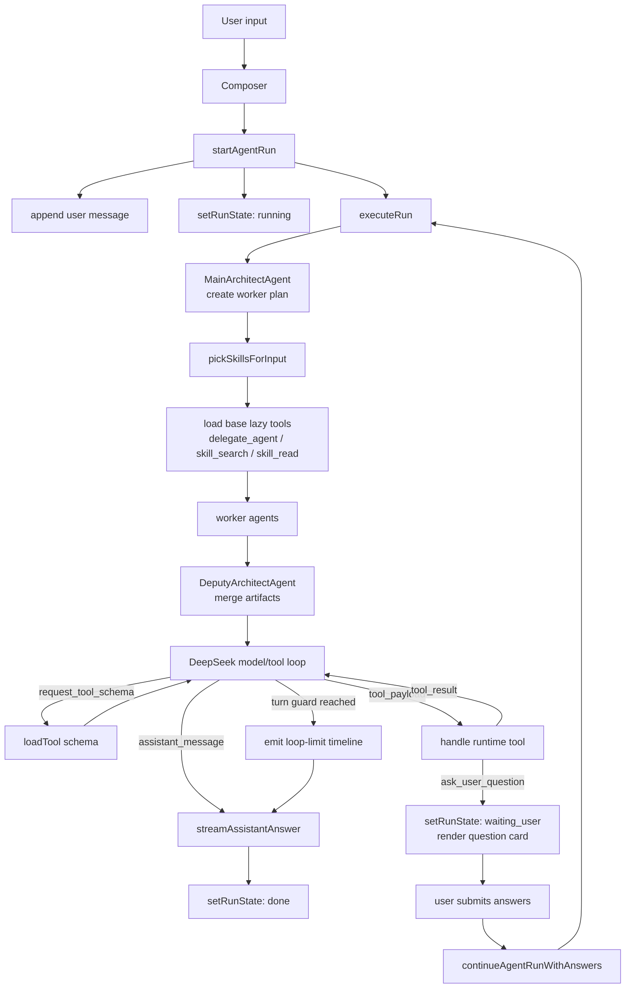
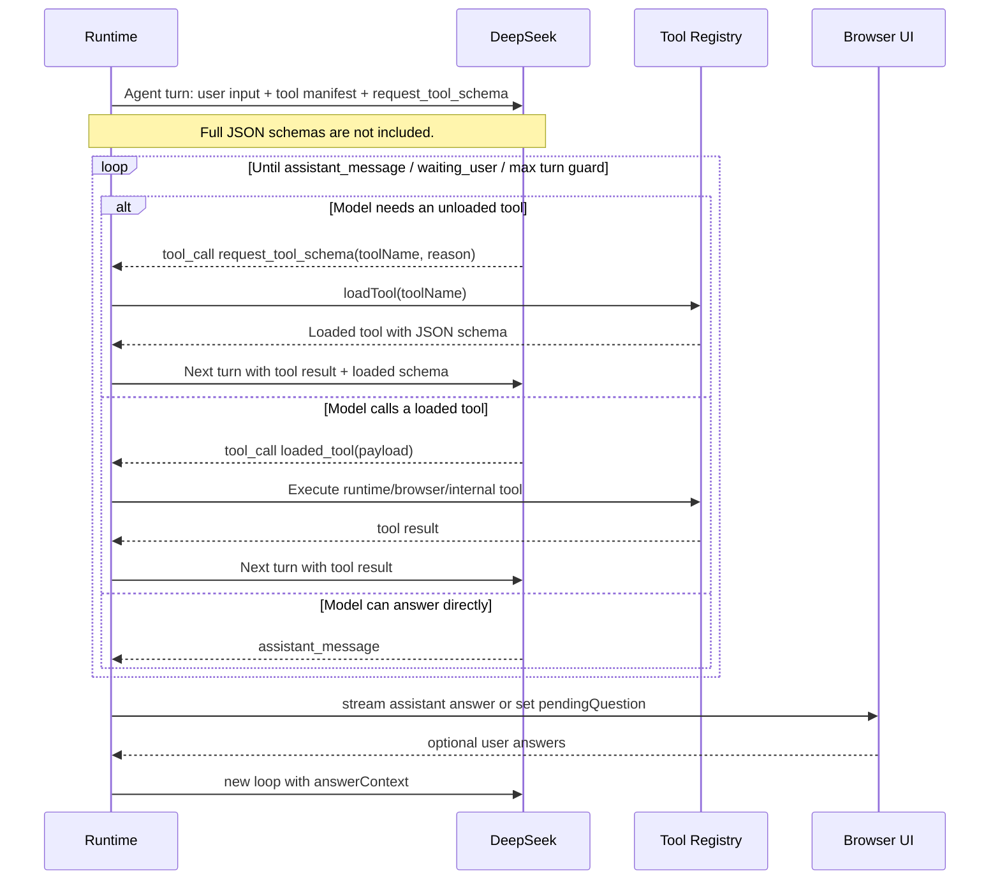
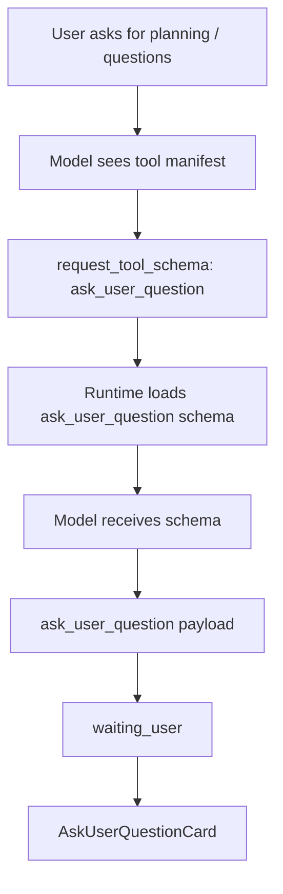

# Web Agent Core Runtime Flow

This document captures the current browser-side agent runtime shape.

## Runtime Overview



## Lazy Tool Protocol

The first model turn does not receive full tool JSON schemas. It only receives a tool manifest with `name`, `description`, and `runtime`. After that, the runtime stays in the same loop until the model returns an assistant message, pauses on user input, or hits the safety guard.



## Prompt Boundary

The first turn prompt stays abstract:

- It describes the lazy tool protocol.
- It lists available tools as a manifest only.
- It does not include concrete JSON schemas.
- It does not hard-code special rules for one tool.
- It says that runtime state changes, pausing, structured input collection, browser-side actions, and delegation should use a matching tool capability.
- It treats user-requested questioning, confirmation, answer collection, and waiting for choices as runtime state changes when a matching tool exists.

Tool-specific behavior belongs to:

- tool summary in `src/agent/tools/registry.ts`
- loaded tool JSON schema in `src/agent/tools/registry.ts`
- runtime handling in `src/agent/runtime/loop.ts`
- UI rendering in `src/chat/*`

## Main Code Map

| Area | File | Responsibility |
| --- | --- | --- |
| Chat shell | `src/chat/ChatShell.tsx` | Layout: messages, run activity, question card, composer, timeline |
| Composer | `src/chat/Composer.tsx` | Starts and stops runs |
| Run activity | `src/chat/RunActivity.tsx` | Inline live progress: agent steps, model thinking, tool calls |
| Ask user UI | `src/chat/AskUserQuestionCard.tsx` | Renders structured questions and submits answers |
| Runtime loop | `src/agent/runtime/loop.ts` | Run lifecycle, workers, tool loading, model turn handling |
| DeepSeek adapter | `src/agent/model/deepseek-adapter.ts` | SSE, thinking stream, tool calls, continuation messages |
| Tool registry | `src/agent/tools/registry.ts` | Tool summaries and lazy-loaded JSON schemas |
| Skill registry | `src/agent/skills/registry.ts` | Repository skill summaries and lazy reads |
| State | `src/agent/state/atoms.ts` | Einfach atoms for sessions, messages, runs, timeline, pending answers |

## AskUserQuestion Path



This is one possible path through the model/tool loop. It is not a hard-coded second turn: any number of schema requests, tool calls, and tool results can happen before the final assistant message or pause.

## Run Statuses

| Status | Meaning |
| --- | --- |
| `idle` | No active run |
| `running` | Runtime is executing agents/model/tools |
| `waiting_user` | Runtime is paused on structured user input |
| `done` | Run completed normally |
| `stopped` | User stopped the active run |
| `error` | Runtime failed |

## Local Development

The project root is:

```bash
/Volumes/work/ai/web-agent
```

Start the app from that directory:

```bash
cd /Volumes/work/ai/web-agent
npm run dev
```
