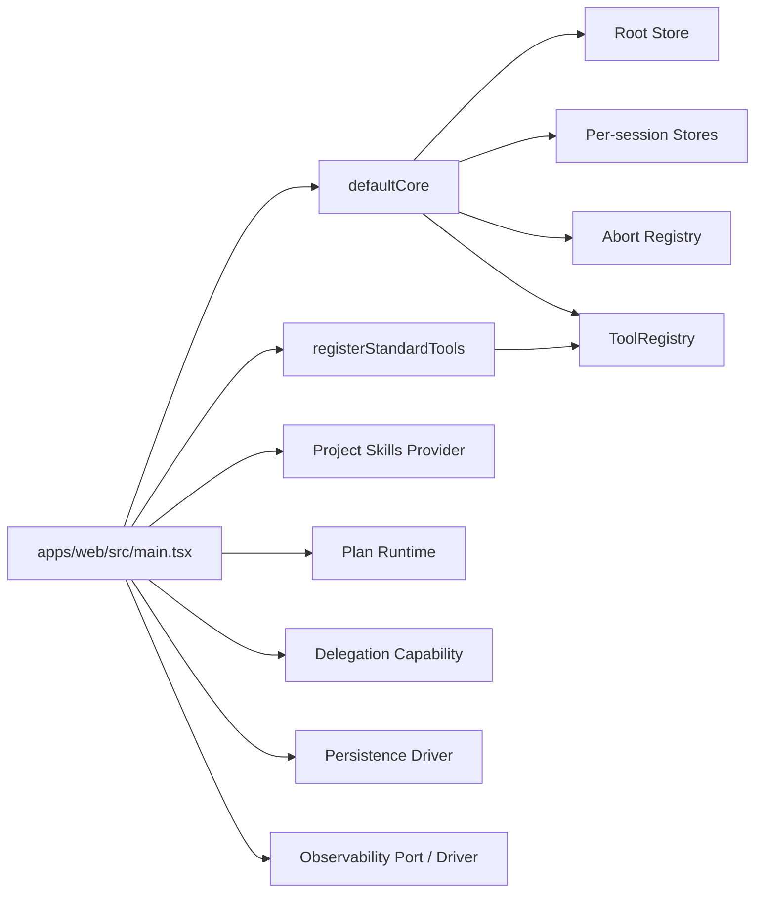
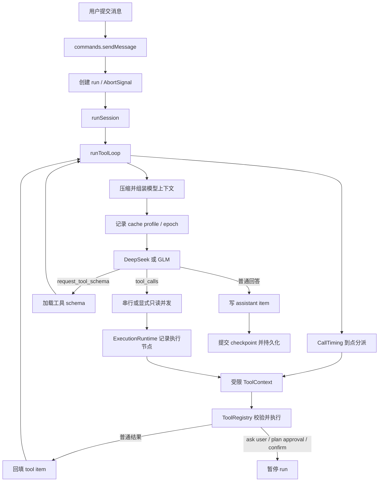

# Core Runtime Flow

本文描述当前 `packages/agent-core` 的主会话运行链路。旧版 `src/agent` / `src/chat`
架构已经删除，不再作为实现依据。

## 装配关系



`defaultCore` 创建时工具 registry 为空。应用入口和测试入口显式安装标准工具，并装配 project
skills、默认 plan runtime、delegation、持久化与观测。需要嵌入 Runtime 的其他消费方可以用
`createCore({ registerTools, projectSkillsProvider, planRuntime, delegation, observability, config })`
创建隔离实例；未注入的能力保持为空或禁用。

## 主链路



`commands.ts` 是 UI 与运行时的命令边界。默认导出绑定 `defaultCore`；
`createCommands(core)` 可以为隔离 core 生成同一套命令。

每次请求仍向 provider 发送完整有效上下文。Runtime 只计算本地 cache profile、lane 和
epoch，并归一化 provider 返回的命中/未命中 token；它不保存或发送 `cache_id`。完整约定见
`docs/context-caching.md`。

## Lazy Tool 协议

模型第一轮只收到：

- 工具摘要 manifest：名称、描述、runtime。
- 已加载工具的完整 JSON Schema。
- `request_tool_schema` 本身的 schema。

模型需要尚未加载的工具时，先调用 `request_tool_schema`。Runtime 将 schema 加入后续请求，
而不是一次把全部标准工具 schema 塞入上下文。

加载有**两个等价入口**。模型拿到 manifest 里的精确名字后经常跳过元工具、直接指名道姓调用；
这次调用本身已经说清「要哪个工具」，因此 runtime 把它**当作一次加载请求**处理，而不是回一条
纯拒绝让模型白烧一轮再问一遍。两条不变量在两个入口上都成立：

- **本次不执行**——模型猜的参数一律不落地，必须按真 schema 重新发起调用；
- **完整 `inputSchema` 只经顶层 `tools` 下发**，不写进消息历史。

只有真正不可加载的调用才硬拒绝（`tool_schema_not_loaded`）：未注册的幻觉工具名，以及 web 下的
`server` 工具。主循环（`modelRun`）与子 agent 循环（`subagents/runtime`）用同一判据——「本轮实际
发给 provider 的 `tools`」；子 agent 另在 spawn 时预载自己那份个位数的授权集，使这道闸门不会挤占
它很小的 `maxTurns`。

实际工具调用经过：

1. `ToolRegistry` 查找与 schema 校验。
2. `modelRun` 创建携带 sessionId、runId、callId 和 AbortSignal 的 `ToolContext`。
3. 工具只调用 context 上明确开放的能力。
4. context 在执行前后检查当前 run，阻止被中止或被新 run 替代的异步结果回写。

工具默认串行。只有显式标记为 `parallel` 的只读工具，且同一批调用全部满足并发条件时，
Runtime 才会并发执行；每个调用无论串行或并发都会写入会话 execution graph。

`callTiming` 非空的工具不进入模型 manifest 或 schema 加载面。`timedDispatch.ts` 复用受限
`ToolContext`，在九个核心时机（session/run/turn、压缩、子 Agent 各自的开始或结束）按注册顺序
执行，并由 `timedToolResultProjection.ts` 记为可持久化 timeline item。宿主或插件可通过
`CoreInstance.dispatchTimedTools` 触发 `<domain>:<event>` 扩展时机；到点调用仍经风险评估，非 safe
调用拒绝执行并记录诊断。

## 暂停与恢复

以下流程会把 run 留在可恢复状态：

- `ask_user_question`：进入 `waiting_user`，UI 收集结构化答案后回填原 tool call。
- 计划需要批准：计划进入 `awaiting_approval`，只有宿主命令可以批准或拒绝。
- 危险工具确认：UI 可以仅本次允许或加入会话级允许集合。

暂停期间不能追加一条普通用户消息破坏 tool-call 序列。恢复命令复用原 runId 和未完成的
tool call 继续循环。

## 状态模型

```text
CoreInstance
├── rootStore
│   ├── sessionsAtom
│   └── activeSessionIdAtom
├── sessionStores: Map<sessionId, Store>
│   ├── itemsAtom
│   ├── runAtom
│   ├── checkpointsAtom
│   ├── planAtom
│   ├── executionGraphAtom
│   └── transient atoms
├── tools: ToolRegistry
├── plugins: PluginHost
├── abort: AbortRegistry
├── observability: ObservabilityPort
├── persistence: PersistenceBridge
├── projectSkills: ProjectSkillsStore
├── planRuntime?: PlanRuntimeFactory
├── delegation?: DelegationCapability
└── config: model keys / fetch
```

共享 atom 对象可以在不同 store 中保存不同值；会话隔离来自 store，而不是
`Record<sessionId, Value>` 分桶。

每个 core 还对应一个进程内 `ExecutionRuntime`，管理正在运行的 Promise 和
AbortController。可持久化的是 execution graph 快照，不是这些进程资源。

所有 await 后写回必须同时满足：

- 会话仍注册在 root store。
- 当前 `runAtom.runId` 仍等于发起时 runId。
- AbortSignal 没有取消。

## 持久化与观测

- Web：IndexedDB history/session driver 和 IndexedDB trace driver。
- Tauri：SQLite history/session driver 和 SQLite trace driver。
- `runAtom` 中的临时暂停状态不作为可靠恢复协议。
- 会话元数据持久化 plan 和 execution graph；history driver 持久化 checkpoint 及其 items。
- hydrate 会把持久化图中未终结的执行节点标记为 `interrupted`，不会尝试恢复旧 Promise。
- `?view=traces` 进入 trace viewer；开发环境还可经 Vite 的 SQLite trace 读取端点查看桌面数据。

## 代码入口

| 领域 | 当前文件 |
| --- | --- |
| 应用装配 | `apps/web/src/main.tsx` |
| UI 组装 | `apps/web/src/agentNew/ui/AppShell.tsx` |
| 命令 API | `packages/agent-core/src/runtime/commands.ts` |
| 模型/工具循环 | `packages/agent-core/src/runtime/modelRun.ts` |
| 单轮请求 | `packages/agent-core/src/runtime/modelTurn.ts` |
| Context cache 诊断 | `packages/agent-core/src/runtime/contextCache.ts` |
| 执行图与后台任务 | `packages/agent-core/src/execution/` |
| Core 实例与能力槽 | `packages/agent-core/src/runtime/core/coreInstance.ts` |
| 到点工具分派与结果投影 | `packages/agent-core/src/runtime/timedDispatch.ts`、`packages/agent-core/src/runtime/timedToolResultProjection.ts` |
| 隔离 Core | `packages/agent-core/src/runtime/core/createCore.ts` |
| 工具抽象 | `packages/agent-core/src/tools/` |
| 工具能力边界 | `packages/agent-core/src/runtime/toolContext.ts` |
| 状态 | `packages/agent-core/src/state/` |
| 模型适配 | `packages/agent-ai/src/` |
| 标准工具聚合 | `tools/standard/src/index.ts` |
| Skills 实现与 L1 清单工具 | `tools/skills/src/` |
| 默认 Plan Runtime | `tools/planning/src/planRuntime.ts` |
| 子 Agent 产品能力 | `packages/subagents/src/` |
| React TraceViewer | `apps/web/src/traceViewer/` |
| Tauri bridge | `apps/desktop/src/lib.rs` |

## 本地验证

```bash
pnpm test
pnpm build
cargo test --manifest-path apps/desktop/Cargo.toml
```
